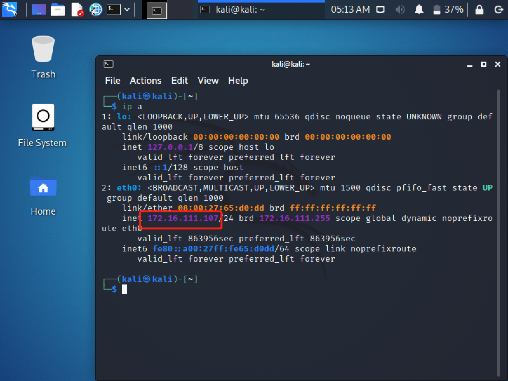
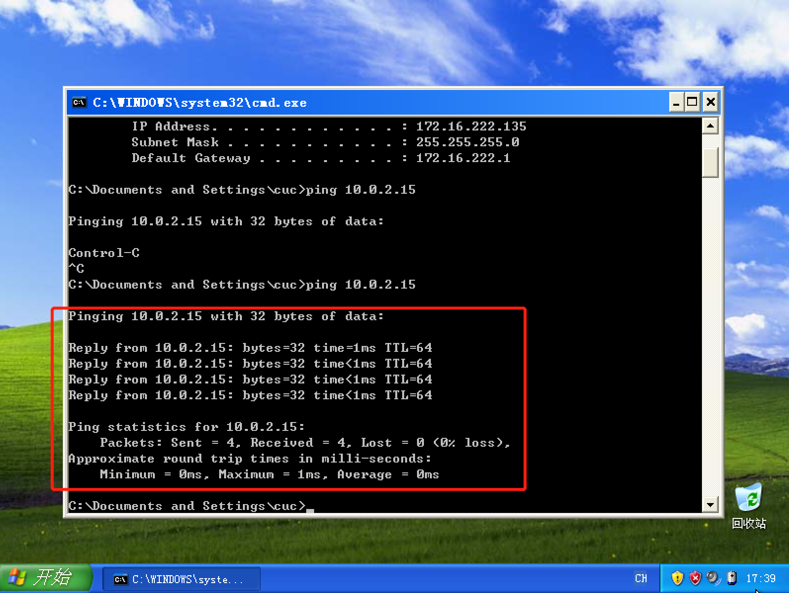
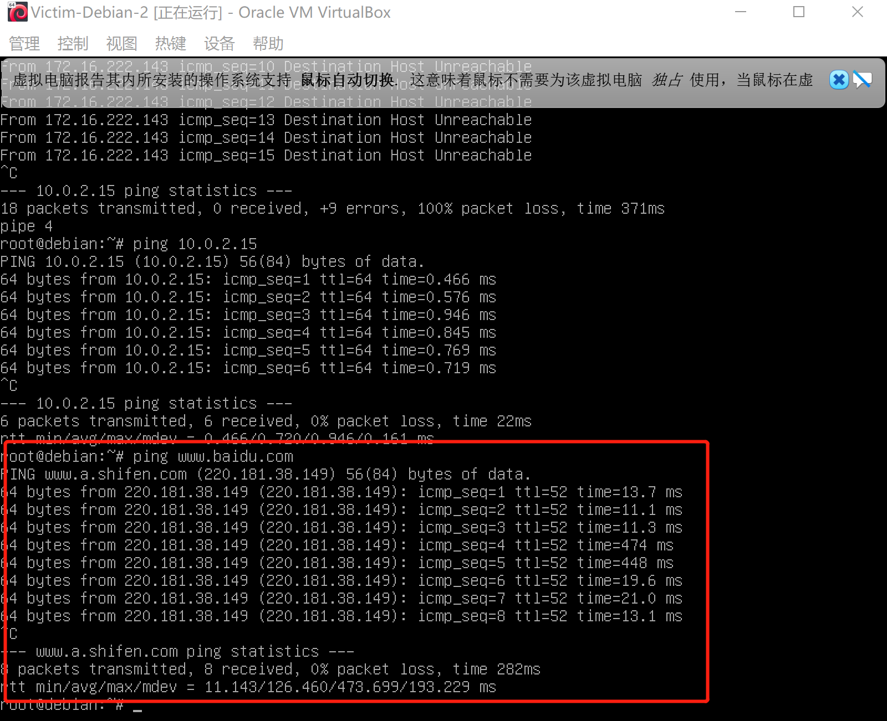

## 实验一 基于 VirtualBox 的网络攻防基础环境搭建

### 实验目的

 * 掌握 VirtualBox 虚拟机的安装与使用；
 * 掌握 VirtualBox 的虚拟网络类型和按需配置；
 * 掌握 VirtualBox 的虚拟硬盘多重加载；

### 实验环境

以下是本次实验需要使用的网络节点说明和主要软件举例：

 * VirtualBox 虚拟机
 * 攻击者主机（Attacker）：kali-linux-2021.2-virtualbox-amd64
 * 网关（Gateway, GW）：Debian10
 * 靶机（Victim）：From Sqli to shell / xp_sp3_base / Kali

### 实验要求

* [ √ ] 靶机可以直接访问攻击者主机

* [ √ ] 攻击者主机无法直接访问靶机

* [ √ ] 网关可以直接访问攻击者主机和靶机

* [ √ ] 靶机的所有对外上下行流量必须经过网关

* [ √ ] 所有节点均可以访问互联网 

### 实验过程

将下载好的kali-linux-2021.2-virtualbox-amd64.ova、xp_sp3_base.vdi、Debian10.vdi分别导入虚拟机，并且将虚拟硬盘配置成多重加载。管理-虚拟介质管理-类型改为多重加载-释放盘片。

需要搭建如下的网络拓扑：


Debian 10配置4块网卡：
 * NAT网络：网关可以访问攻击者主机
 * Host-only：方便使用ssh
 * 两个内部网络：搭建两个独立的局域网intnet1和intnet2
  
具体配置如下图所示：


Debian登录口令root/toor（默认），密码后面修改为1234.查看IP地址为192.168.91.3.
kali登录口令为kali/kali（默认）

配置ssh登录，在主机生成公私钥`ssh-keygen`，并将其导入虚拟机。修改虚拟机中的sshd文件/etc/ssh/sshd_config
```

PermitRootLogin yes
PubkeyAuthentication yes
PasswordAuthentication yes

```


打开cmd，配置ssh 免密登录。
`ssh-copy-id -i ~/.ssh/id_rsa.pub root@192.168.91.3`


免密登录配置成功！

修改xp的网卡内部网络芯片为如下图所示：


配置xp中的网络连接。具体配置如下图所示：


发现仍ping不通，这时需要关闭防火墙。

我们需要修改Debian 10中的配置文件，我的电脑里面可以使用vim就不再使用vi
`vim /etc/network/interfaces`

重启
/sbin/ifup enp0s9
/sbin/ifup enp0s10
sudo systemctl restart networking

安装dnsmasq
```
apt-get update  
apt-get install dnsmasq
```


修改/etc/dnsmasq.d/gw-enp09.conf
interface=enp0s9
dhcp-range=172.16.111.10,172.16.111.150,240h

修改/etc/dnsmasq.d/gw-enp10.conf
interface=enp0s10
dhcp-range=172.16.222.10,172.16.222.150,240h


备份dnsmasq.conf文件
cp dnsmasq.conf dnsmasq.conf.bak

修改dnsmasq.conf文件。我的文件中已经修改好了，我就没有修改，检查无误之后就可以。
```
#log-dhcp--->log-dhcp
#log-queries--->log-queries
#在log-queries下面加一条命令
log-facility=/var/log/dnsmasq.log
```

重启dnsmasq
/etc/init.d/dnsmasq restart 

Debian 10 网卡配置结果如下：


其他四个靶机IP配置如下图所示：





attacker IP配置如下：


网络连通性测试

1.靶机可以直接访问攻击者主机




2.攻击者主机无法直接访问靶机


3.网关可以直接访问攻击者主机和靶机


4.靶机的所有对外上下行流量必须经过网关&所有节点均可以访问互联网





### 参考资料

* https://www.bilibili.com/video/BV16t4y1i7rz?p=12
* https://github.com/CUCCS/2020-ns-public-Annna777/blob/chap0x01/chap0x01/chap01.md

### 实验问题
* SSH远程访问出现Permission denied(publickey,password)解决方法 
  https://blog.csdn.net/qq_41571459/article/details/113530829
  https://blog.csdn.net/BakerTheGreat/article/details/104300128
* ssh 免密码登录（设置后仍需输密码的原因及解决方法）
  https://www.cnblogs.com/guanyf/p/10600458.html