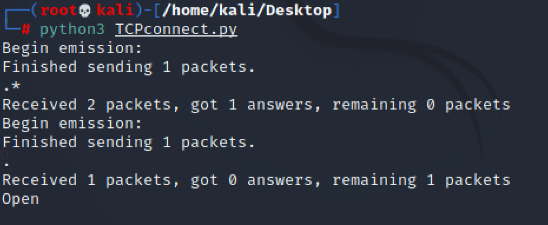
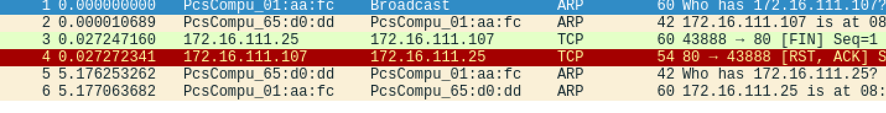

## 实验五 基于 Scapy 编写端口扫描器

### 实验目的

* 掌握网络扫描之端口状态探测的基本原理


### 实验环境

* python + scapy
* nmap

### 实验要求

- [x]  禁止探测互联网上的 IP ，严格遵守网络安全相关法律法规
- [x]  完成以下扫描技术的编程实现
   - [x]  TCP connect scan / TCP stealth scan
   - [x]  TCP Xmas scan / TCP fin scan / TCP null scan
   - [x]  UDP scan
- [x]  上述每种扫描技术的实现测试均需要测试端口状态为：开放、关闭 和 过滤 状态时的程序执行结果
- [x]  提供每一次扫描测试的抓包结果并分析与课本中的扫描方法原理是否相符？如果不同，试分析原因；
- [x]  在实验报告中详细说明实验网络环境拓扑、被测试 IP 的端口状态是如何模拟的
- [x]  （可选）复刻 nmap 的上述扫描技术实现的命令行参数开关

### 网络拓扑结构

身份 | 虚拟机名称 |   IP  |
-|-|-
网关 | Debian 10 | 172.16.111.1
攻击者主机 | attacker-kali | 172.16.111.25
目标靶机 | Victim-Kali-1 | 172.16.111.107

网络拓扑结构同实验四

### 实验过程

##### 0 主机状态设置
端口不是独立存在的，它是依附于进程的。某个进程开启，那么它对应的端口就开启了，进程关闭，则该端口也就关闭了。

* `Open`状态

```
# 开启apache服务，以启用端口80
service apache2 start

#开启dnsmasq服务，以启用端口53
apt-get install dnsmasq
service dnsmasq start

# 查看开启状态
netstat -ntulp | grep 80 
```


* `Close`状态

```
# 关闭apache服务，以关闭端口80
service apache2 stop

# 查看80端口对应的进程
lsof -i:80
```


* `Filtered`状态
```
# 安装 ufw 防火墙（Kali 2019 没有自带防火墙）
apt-get install ufw 

# 查看防火墙状态（默认 inactive）
ufw status

# 开启apache服务的同时开启防火墙，模拟filtered状态
ufw enable

# 关闭防火墙
ufw disable
```


#### 1 TCP connect scan
编写`TCPconnec.py`，代码如下：
```
#! /usr/bin/python
import logging
logging.getLogger("scapy.runtime").setLevel(logging.ERROR)
from scapy.all import *

dst_ip = "172.16.111.107"
client_port = 8888
dst_port=80

tcp_connect_scan_resp = sr1(IP(dst=dst_ip)/TCP(sport = client_port,dport = dst_port,flags = "S"),timeout = 10)

if(tcp_connect_scan_resp==None):
    print("Flitered")
elif(tcp_connect_scan_resp.haslayer(TCP)):
    if(tcp_connect_scan_resp.getlayer(TCP).flags==0x12):
        send_rst = sr1(IP(dst=dst_ip)/TCP(sport = client_port,dport = dst_port,flags=0x14),timeout = 10)
        print("Open")
    elif(tcp_connect_scan_resp.getlayer(TCP).flags==0x14):
        print("Closed")

```
`nmap -p80 -sT 172.16.111.107`

* 测试开放端口
  * 扫描过程
    * scapy扫描
  
      

    * nmap扫描

      

 * 数据包分析
   * scapy扫描
      
   * nmap扫描
     


* 测试关闭端口
  * 扫描过程
    * scapy扫描
  
    * nmap扫描
  
  * 数据包分析
    * scapy 扫描
  
    * nmap扫描
  


* 测试过滤端口
  * 扫描过程
    * scapy扫描
  
    * nmap扫描
  
  * 数据包分析
    * scapy 扫描
  
    * nmap扫描
  


#### 2 TCP stealth scan
编写`tcpStealthScan.py`，代码如下：

```
#! /usr/bin/python

import logging
logging.getLogger("scapy.runtime").setLevel(logging.ERROR)
from scapy.all import *

dst_ip = "172.16.111.107"
src_port = 8888
dst_port = 80

stealth_scan_resp = sr1(IP(dst=dst_ip)/TCP(sport=src_port,dport=dst_port,flags="S"),timeout=10)
if(stealth_scan_resp==None):
    print ("filtered: no response")
elif(stealth_scan_resp.getlayer(TCP)):
    if(stealth_scan_resp.getlayer(TCP).flags==0x12):
        send_rst=sr(IP(dst=dst_ip)/TCP(sport=src_port,dport=dst_port,flags="R"),timeout=10)
        print ("open")
    elif(stealth_scan_resp.getlayer(TCP).flags==0x14):
        print ("closed")
    elif(stealth_scan_resp.haslayer(ICMP)):
        if(int(stealth_scan_resp.getlayer(ICMP).type)==3 and int(stealth_scan_resp.getlayer(ICMP).code) in [1,2,3,9,10,13]):
            print ("filtered: receive ICMP but destination inreachable")
```
`nmap -p80 -sS 172.16.111.107`

* 开放端口
  * 扫描过程
    * scapy扫描
  
    * nmap扫描
  
  * 数据包分析
    * scapy 扫描
  
    * nmap扫描
  

* 测试关闭端口
  * 扫描过程
    * scapy扫描
  
    * nmap扫描
  
  * 数据包分析
    * scapy 扫描
  
    * nmap扫描
  

* 测试过滤端口
  * 扫描过程
    * scapy扫描
  
    * nmap扫描
  
  * 数据包分析
    * scapy 扫描
  
    * nmap扫描
  


#### 3 TCP Xmas scan
编写`tcpXmasScan.py`，代码如下：
```
#! /usr/bin/python
 
import logging
logging.getLogger("scapy.runtime").setLevel(logging.ERROR)
from scapy.all import *
 
dst_ip = "172.16.111.107"
src_port = 8888
dst_port=80
 
xmas_scan_resp = sr1(IP(dst=dst_ip)/TCP(dport=dst_port,flags="FPU"),timeout=10)
if (xmas_scan_resp==None):
    print ("Open|Filtered")
elif(xmas_scan_resp.haslayer(TCP)):
    if(xmas_scan_resp.getlayer(TCP).flags == 0x14):
        print ("Closed")
elif(xmas_scan_resp.haslayer(ICMP)):
    if(int(xmas_scan_resp.getlayer(ICMP).type)==3 and int(xmas_scan_resp.getlayer(ICMP).code) in [1,2,3,9,10,13]):
        print ("Filtered")
```
`nmap -p80 -sX 172.16.111.107`
* 测试开放端口
  * 扫描过程
    * scapy扫描
  
    * nmap扫描
  
  * 数据包分析
    * scapy 扫描
  
    * nmap扫描
  
* 测试关闭端口
  * 扫描过程
    * scapy扫描
  
    * nmap扫描
  
  * 数据包分析
    * scapy 扫描
  
    * nmap扫描
  
* 测试过滤端口
  * 扫描过程
    * scapy扫描
  
    * nmap扫描
  
  * 数据包分析
    * scapy 扫描
  
    * nmap扫描
  

#### 4 TCP fin scan
编写`tcpFinScan.py`，代码如下：
```
#! /usr/bin/python
 
import logging
logging.getLogger("scapy.runtime").setLevel(logging.ERROR)
from scapy.all import *
 
dst_ip = "172.16.111.107"
src_port = 8888
dst_port=80
 
fin_scan_resp = sr1(IP(dst=dst_ip)/TCP(dport=dst_port,flags="F"),timeout=10)
if (fin_scan_resp==None):
    print ("Open | Filtered | Closed")
elif(fin_scan_resp.haslayer(TCP)):
    if(fin_scan_resp.getlayer(TCP).flags == 0x14):
        print ("Closed")
elif(fin_scan_resp.haslayer(ICMP)):
    if(int(fin_scan_resp.getlayer(ICMP).type)==3 and int(fin_scan_resp.getlayer(ICMP).code) in [1,2,3,9,10,13]):
        print ("Filtered")
```
`nmap -p80 -sF 172.16.111.107`

* 开放端口
  * 扫描过程
    * scapy扫描
  
    * nmap扫描
  
  * 数据包分析
    * scapy 扫描
  
    * nmap扫描
  

* 测试关闭端口
  * 扫描过程
    * scapy扫描
  
    * nmap扫描
  
  * 数据包分析
    * scapy 扫描
  
    * nmap扫描
  

* 测试过滤端口
  * 扫描过程
    * scapy扫描
  
    * nmap扫描
  
  * 数据包分析
    * scapy 扫描
  
    * nmap扫描
  


#### 5 TCP null scan
编写`tcpNullScan.py`，代码如下：
```
#! /usr/bin/python
 
import logging
logging.getLogger("scapy.runtime").setLevel(logging.ERROR)
from scapy.all import *
 
dst_ip = "172.16.111.107"
src_port = 8888
dst_port=80
 
null_scan_resp = sr1(IP(dst=dst_ip)/TCP(dport=dst_port,flags=""),timeout=10)
if (null_scan_resp==None):
    print ("Open|Filtered|Closed")
elif(null_scan_resp.haslayer(TCP)):
    if(null_scan_resp.getlayer(TCP).flags == 0x14):
        print ("Closed")
elif(null_scan_resp.haslayer(ICMP)):
    if(int(null_scan_resp.getlayer(ICMP).type)==3 and int(null_scan_resp.getlayer(ICMP).code) in [1,2,3,9,10,13]):
        print ("Filtered")
```
`nmap -p80 -sN 172.16.111.107`
* 开放端口
  * 扫描过程
    * scapy扫描
  
    * nmap扫描
  
  * 数据包分析
    * scapy 扫描
  
    * nmap扫描
  

* 测试关闭端口
  * 扫描过程
    * scapy扫描
  
    * nmap扫描
  
  * 数据包分析
    * scapy 扫描
  
    * nmap扫描
  

* 测试过滤端口
  * 扫描过程
    * scapy扫描
  
    * nmap扫描
  
  * 数据包分析
    * scapy 扫描
  
    * nmap扫描
  


#### 6 UDP scan
编写`udpScan.py`，代码如下：
```
#!/usr/bin/python
import logging
logging.getLogger("scapy.runtime").setLevel(logging.ERROR)
from scapy.all import*

dst_ip = "172.16.111.107"
src_port = 8888
dst_port = 53

udp_scan_resp=sr1(IP(dst=dst_ip)/UDP(dport=dst_port),timeout=5,verbose=0)
if(udp_scan_resp==None):
    print("open | filtered | closed")
elif(udp_scan_resp.haslayer(ICMP)):
    if(udp_scan_resp.getlayer(ICMP).type==3 and udp_scan_resp.getlayer(ICMP).code==3):
        print("closed")
```
`nmap -sU -p80 172.16.111.107` 

* 开放端口
  * 扫描过程
    * scapy扫描
  
    * nmap扫描
  
  * 数据包分析
    * scapy 扫描
  
    * nmap扫描
  

* 测试关闭端口
  * 扫描过程
    * scapy扫描
  
    * nmap扫描
  
  * 数据包分析
    * scapy 扫描
  
    * nmap扫描
  

* 测试过滤端口
  * 扫描过程
    * scapy扫描
  
    * nmap扫描
  
  * 数据包分析
    * scapy 扫描
  
    * nmap扫描
  

### 实验问题  
1.[no moudle named scapy](https://www.jianshu.com/p/0967710a3b9f)
模块路径在python3下面，python默认路径只有python2的，可以在执行py文件时候，用`python3 XXXX.py`

2.[PermissionError: [Errno 1] Operation not permitted](https://stackoverflow.com/questions/44304988/permissionerror-errno-1-operation-not-permitted)
需要用到root用户

`sudo su`

### 实验总结
扫描实验中，TCP connect/TCP stealth扫描属于开放扫描，TCP Xmas/TCP FIN/TCP NULL扫描属于隐蔽扫描，UDP 扫描也属于开放扫描。我认为TCP`隐蔽扫描`能有效避免对方入侵检测系统和防火墙的检测，但这种扫描使用的数据包在通过网络时容易被丢弃从而产生错误的探测信息，而`开放扫描`会产生大量审计数据，容易被对方发现，但其可靠性高。


总结各种扫描方式所对应的状态：

  |     扫描方式/端口状态     |              开放               |      关闭       |      过滤       |
  | :-----------------------: | :-----------------------------: | :-------------: | :-------------: |
  |  TCP connect/TCP stealth  | 完整的三次握手，能抓到ACK&RST包 | 只收到一个RST包 | 收不到任何TCP包 |
  | TCP Xmas/TCP FIN/TCP NULL |         收不到TCP回复包         |  收到一个RST包  | 收不到TCP回复包 |
  |            UDP            |          收到UDP回复包          | 收不到UDP回复包 | 收不到UDP回复包 |

nmap是一款强大的网络扫描工具，使用起来很方便，能实现很多编程能实现的功能

scapy的功能也很强大，可以很容易的构造出一些伪造包或者伪造源的包，很容易实现对靶机的伤害

端口的开放与关闭是防火墙的角度，scapy编程只是判断可达不可达，监听更多是从进程的角度，而UDP本身没有开放和关闭这些状态，只是为了观察我们模仿TCP

### 参考资料

1.https://github.com/CUCCS/2020-ns-public-yumlii33/blob/exp5/chap0x05/chap0x05.md

2.[Linux如何查看端口状态](https://www.cnblogs.com/anyone55/p/12060095.html)

3.https://github.com/CUCCS/2019-NS-Public-chencwx/edit/ns_chap0x05/ns_chapter5/%E7%BD%91%E7%BB%9C%E6%89%AB%E6%8F%8F%E5%AE%9E%E9%AA%8C%E6%8A%A5%E5%91%8A.md